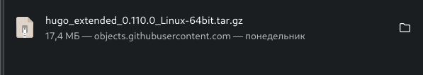
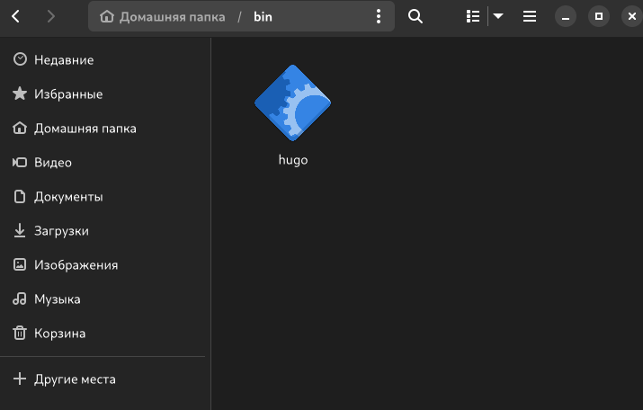
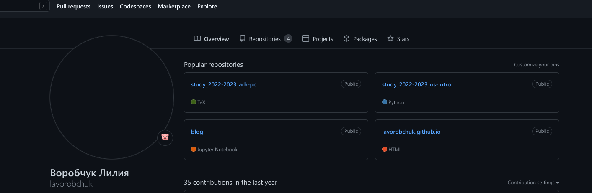
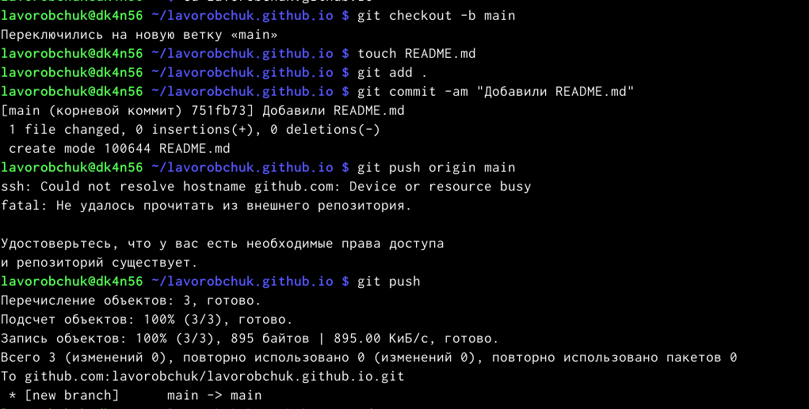
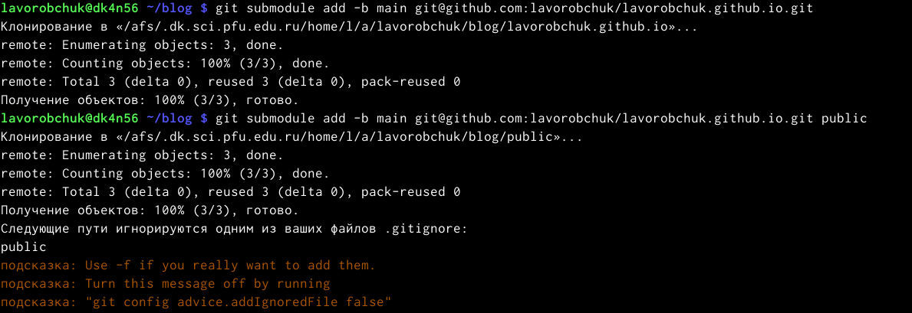
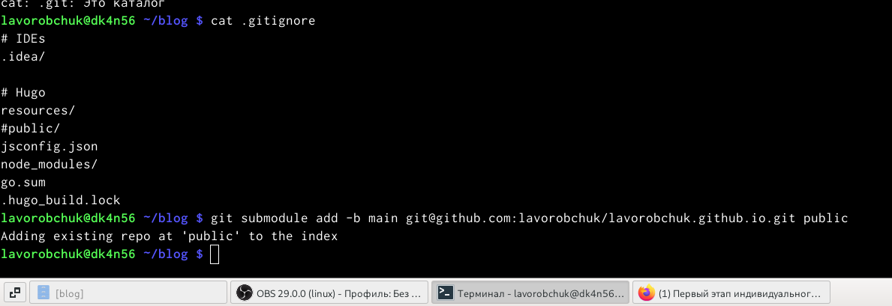
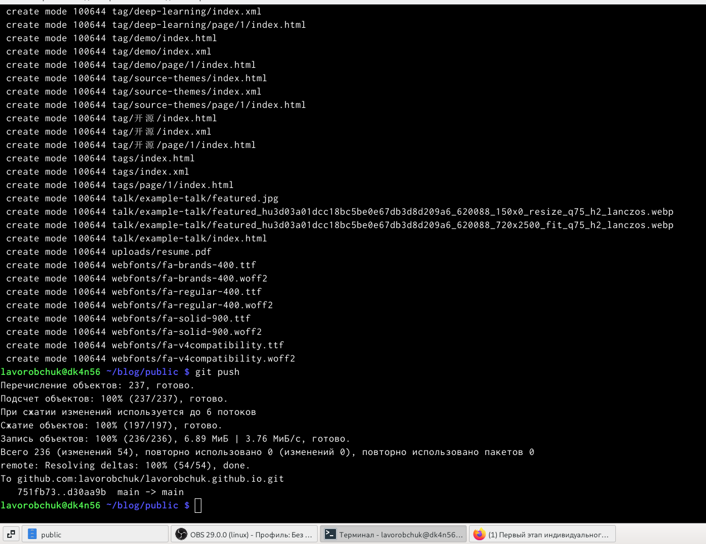
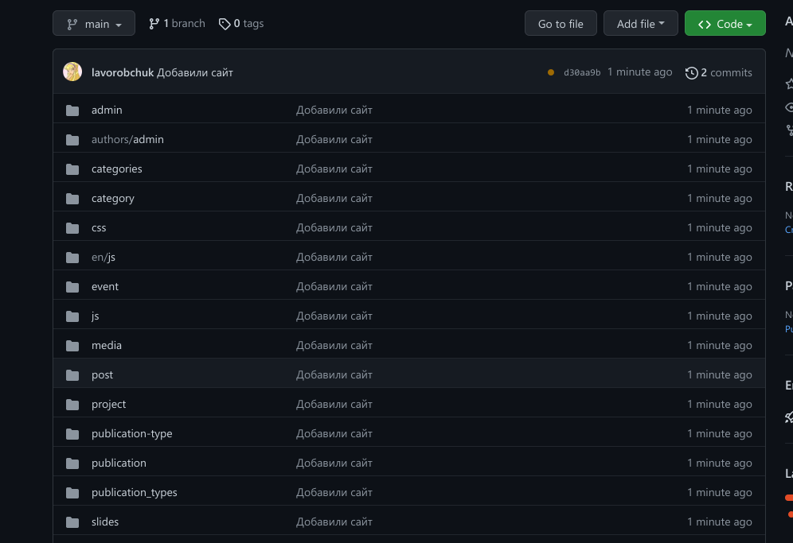
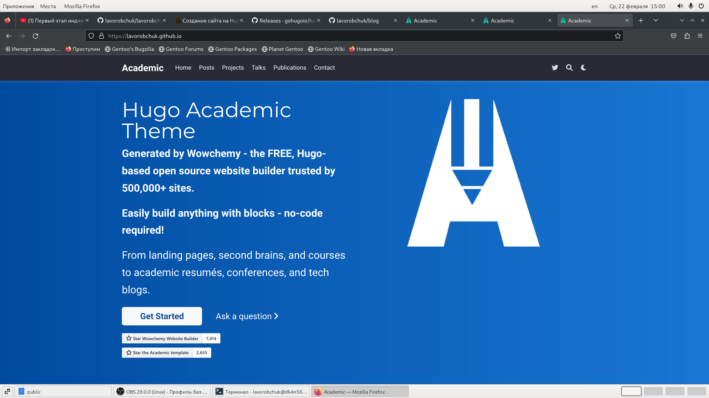

---
## Front matter
lang: ru-RU
title: Индивидуальный проект
subtitle: Этап 1
author:
  - Воробчук Лилия
institute:
  - Российский университет дружбы народов, Москва, Россия
 
date: 22 февраля 2023

## i18n babel
babel-lang: russian
babel-otherlangs: english

## Formatting pdf
toc: false
toc-title: Содержание
slide_level: 2
aspectratio: 169
section-titles: true
theme: metropolis
header-includes:
 - \metroset{progressbar=frametitle,sectionpage=progressbar,numbering=fraction}
 - '\makeatletter'
 - '\beamer@ignorenonframefalse'
 - '\makeatother'
---

# Вводная часть

## Цель работы

- Цель данного этапа индивидуального проекта - приобрести практические навыки создания заготовки персонального сайта.

#Основная часть

## Скачиваю файл hugo_extended_0.110.0_Linux-64bit.tar.gz

## Копирую файл hugo в папку bin

## Cоздаю репозиторий blog

## Cоздаю еще один репозиторий lavorobchuk.github.io

## Гит клонирую новый репозиторий

## Создаю main ветку

## Подключение репозитория к папке public

## Исправление ошибки в mc

## Командой bin hugo cоздаю в папке файлы 

## Пушу на гитхаб созданные файлы

## Мой сайт

# Заключение

## Вывод

В результате выполнения данного этапа индивидуального проекта были получены прикладные навыки cоздания заготовки персонального сайта.

