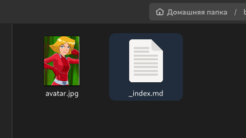
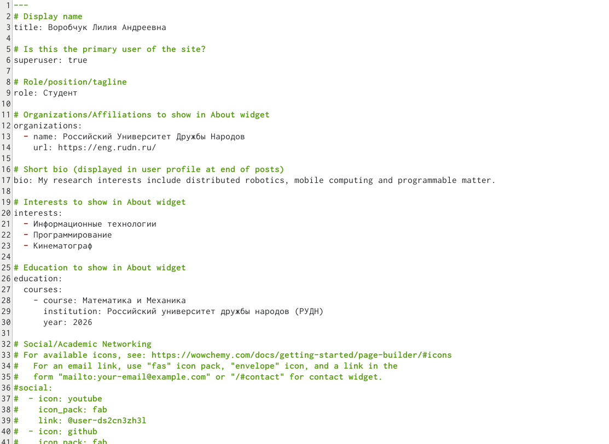
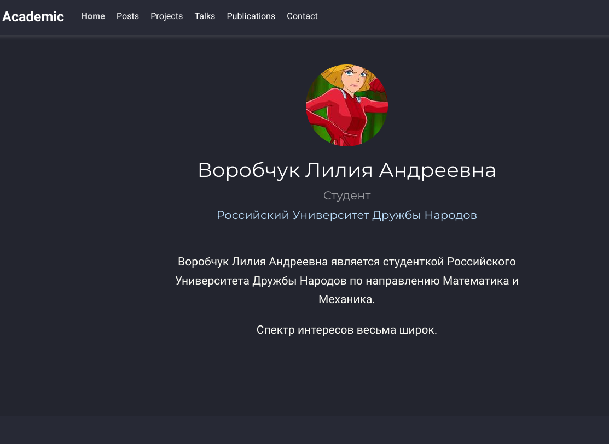
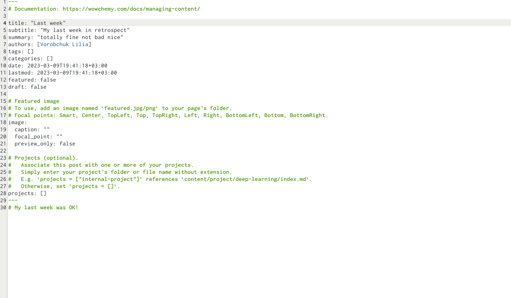
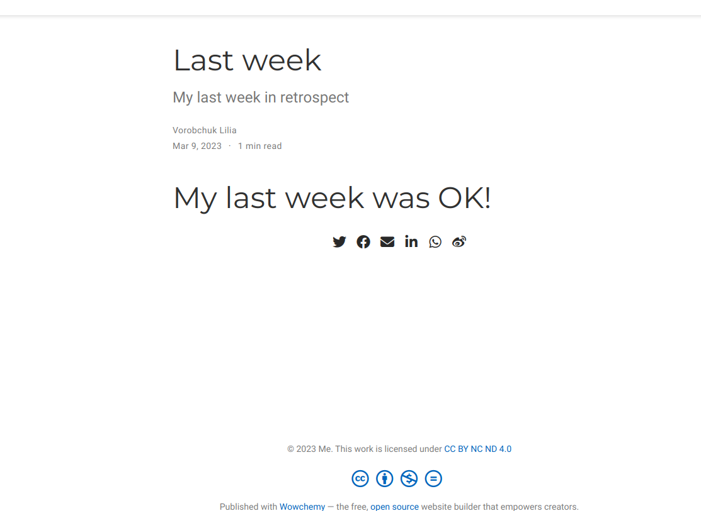
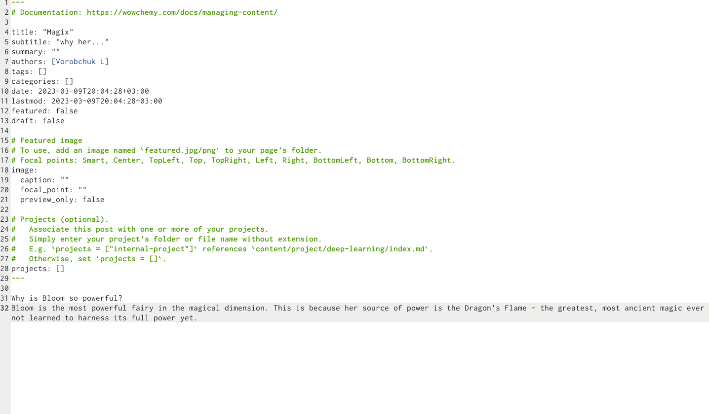
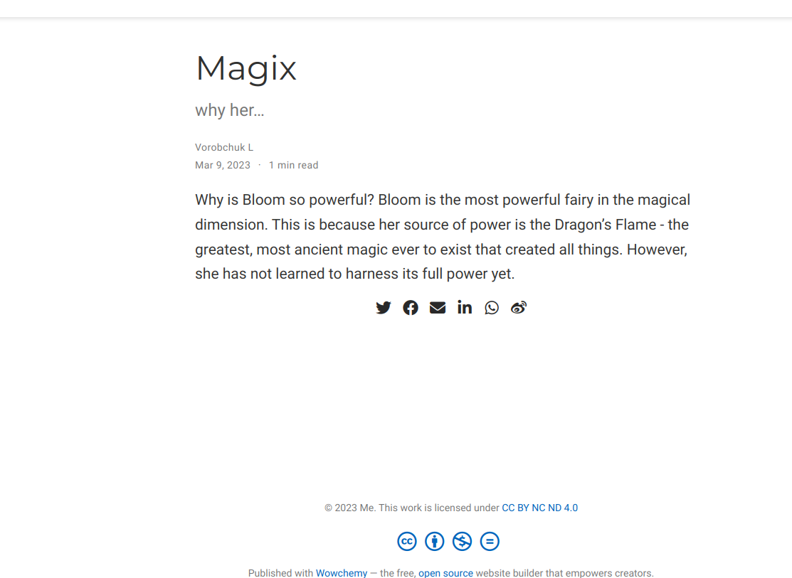

---
## Front matter
lang: ru-RU
title: Индивидуальный проект
subtitle: Этап 1
author:
  - Воробчук Лилия
institute:
  - Российский университет дружбы народов, Москва, Россия
 
date: 22 февраля 2023

## i18n babel
babel-lang: russian
babel-otherlangs: english

## Formatting pdf
toc: false
toc-title: Содержание
slide_level: 2
aspectratio: 169
section-titles: true
theme: metropolis
header-includes:
 - \metroset{progressbar=frametitle,sectionpage=progressbar,numbering=fraction}
 - '\makeatletter'
 - '\beamer@ignorenonframefalse'
 - '\makeatother'
---

# Вводная часть

## Цель работы

- Добавить к сайту данные о себе, а также разместить несколько постов.

#Основная часть

## Размещаю фотографию владельца сайта, для этого заменяю фото из шаблона на свое

## Размещаю основную информацию: мое имя, название университета и ссылка на сайт, краткое описание владельца сайта (Biography), добавляю информацию об интересах (Interests)и об образовании (Education):

## Получив ссылку на локальный сайт с помощью ~/bin/hugo server, проверяю изменения содержимого:

## Создаю пост о прошедшей неделе, размещая необходимую информацию:

Для этого выполняю команду ~/bin/hugo new post/last_week и заполняю пост информацией

## Затем создаю пост на тему “Блум - самая сильная фея”:

Аналогично пункту 3 выполняю команду ~/bin/hugo new post/Git и заполняю пост информацией

## Затем я проверяю изменения на локальном сайте:

# Заключение

## Вjвод

В ходе выполнения второго этапа индивидуального проекта я добавила к сайту данные о себе, а также разместила несколько постов. 
