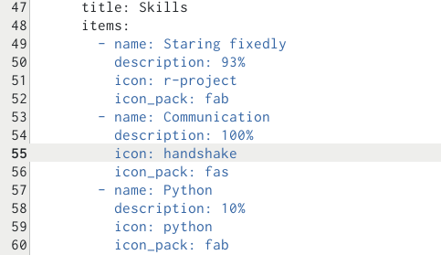
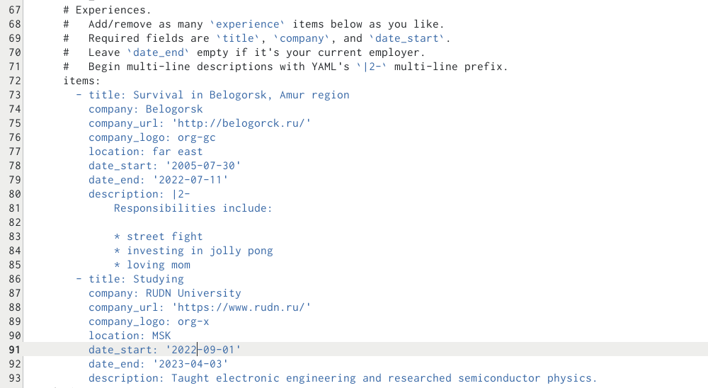
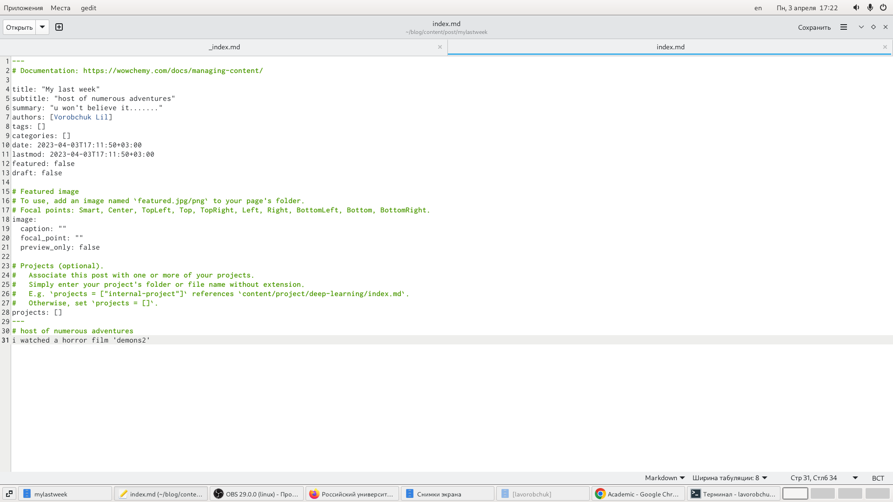
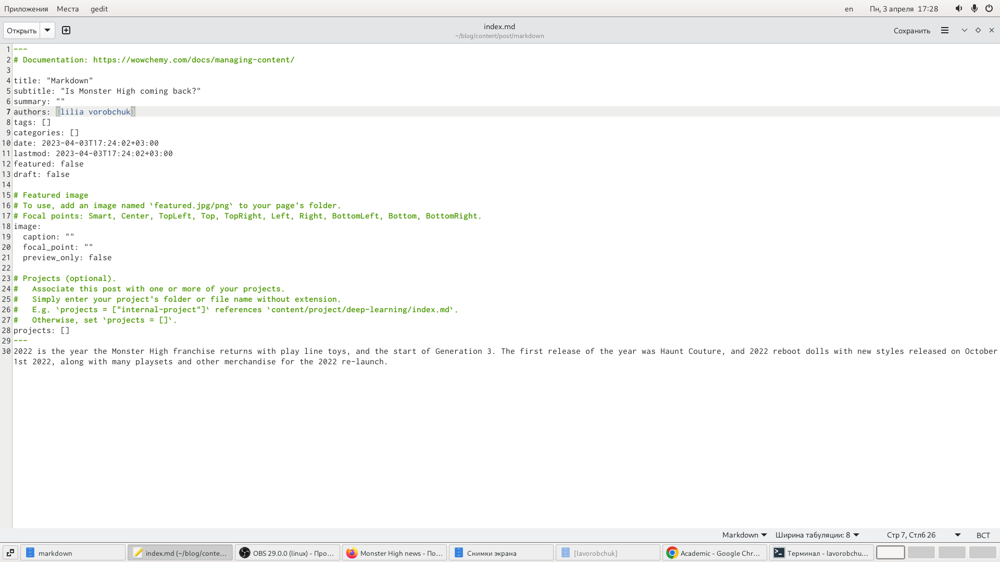
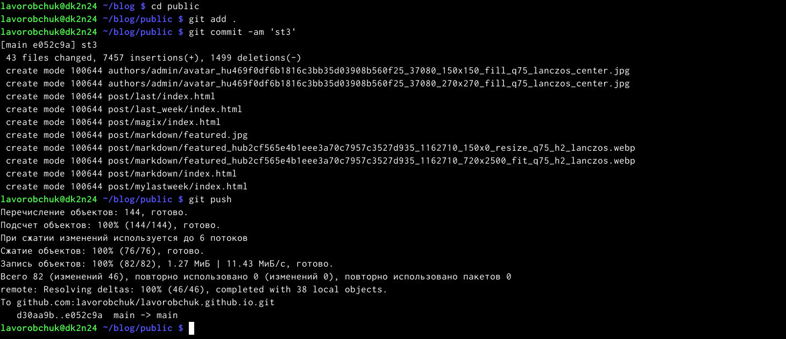
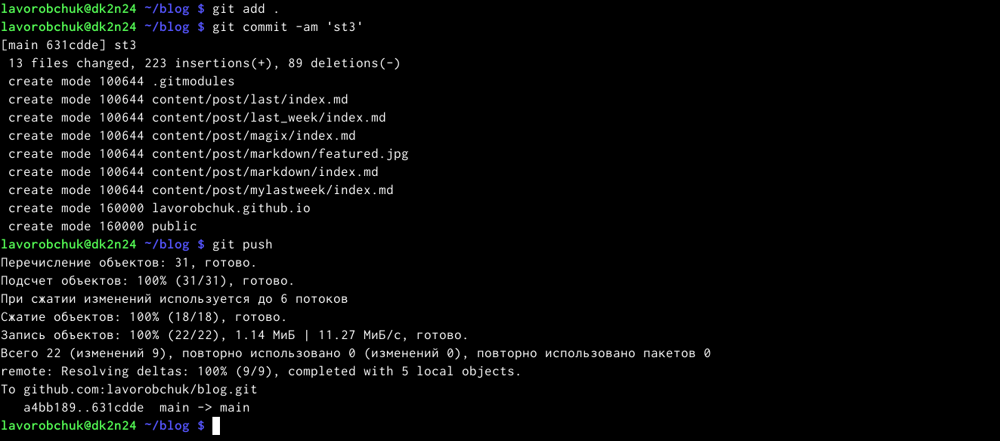

---
## Front matter
lang: ru-RU
title: Индивидуальный проект
subtitle: Этап 3
author: |
	л.а.воробчук 
institute: |
	RUDN University, Moscow, Russian Federation
date: 2023, 4 апрель

## Formatting
toc: false
slide_level: 2
theme: metropolis
header-includes: 
 - \metroset{progressbar=frametitle,sectionpage=progressbar,numbering=fraction}
 - '\makeatletter'
 - '\beamer@ignorenonframefalse'
 - '\makeatother'
aspectratio: 43
section-titles: true
---

## Цель работы 

Добавить к сайту информацию о навыках, опыте и достижениях, а также разместить несколько постов.

## Задание

Добавить к сайту достижения:

       Список достижений.
       
       Добавить информацию о навыках (Skills).
       
       Добавить информацию об опыте (Experience).
       
       Добавить информацию о достижениях (Accomplishments).

## Задание 
       
Сделать пост по прошедшей неделе.
       
Добавить пост на тему по выбору:
       
       Легковесные языки разметки.
       
       Языки разметки. LaTeX.
       
       Язык разметки Markdown.

## Выполнение 

Введя команду ~/bin/hugo server, получаю ссылку на локальный сайт, на котором буду промежуточно отслеживать все изменения. 

Изменяю информацию о навыках, меняю навыки из шаблона на свои:

{ #fig:001 width=50% }

## Выполнение 

{ #fig:002 width=70% }

## Выполнение 

Изменяю информацию об опыте, меняю опыт из шаблона на свой:

{ #fig:003 width=45% }

## Выполнение 

Изменяю информацию о достижениях, меняю достижения из шаблона на свои:

{ #fig:004 width=45% }

## Выполнение 

Введя команду ~/bin/hugo new post/last_week1, создаю новый пост на тему о прошедшей неделе:

{ #fig:005 width=70% }

## Выполнение 

Затем заполняю созданный пост информацией о прошедшей неделе:

{ #fig:006 width=50% }

## Выполнение 

Далее проверяю изменения на локальном сайте, ссылку на который я получила в начале с помощью команды ~/bin/hugo server.

{ #fig:07 width=70% }

## Выполнение 

Создаю второй пост markdown, вновь используя команду ~/bin/hugo new post/markdown.

{ #fig:008 width=70% }

## Выполнение 

Далее заполняю пост необходимой информацией и добавляю картинку.

{ #fig:009 width=50% }

## Выполнение 

Проверяю изменения на локальном сайте, ссылку на который я получила в начале с помощью команды ~/bin/hugo server.

{ #fig:010 width=50% }

## Выполнение 

Затем в каталоге blog выполняю ~/bin/hugo. 

{ #fig:011 width=70% }

## Выполнение 

Затем отправляю изменения на сервер. 

{ #fig:012 width=70% }

## Выполнение 

{ #fig:013 width=70% }

## Выполнение 

Затем проверяю изменения на публичном сайте и убеждаюсь что выполненные действия корректны.

{ #fig:014 width=70% }

## Выполнение 

{ #fig:015 width=70% }

## Вовод

В ходе выполнения третьего этапа индивидуального проекта я добавила к сайту информацию о навыках, достижениях и опыте, а также разместила несколько постов.

